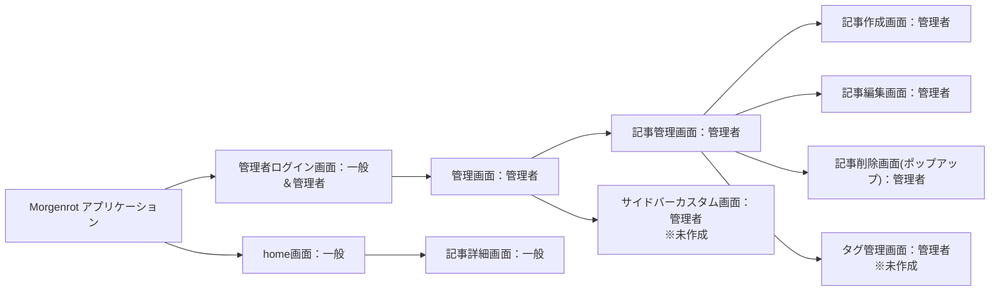

```mermaid
graph LR

  id_0[Morgenrot アプリケーション]-->id_1["管理者ログイン画面：一般＆管理者"]
  id_0[Morgenrot アプリケーション]-->id_2["home画面：一般"]
  
    id_1-->id_1_1["管理画面：管理者"]
    id_2-->id_2_1["記事詳細画面：一般"]
    
      id_1_1-->id_1_1_1["記事管理画面：管理者"]
      id_1_1-->id_1_1_2["サイドバーカスタム画面：管理者</br>※未作成"]
      
        id_1_1_1-->id_1_1_1_1["記事作成画面：管理者"]
        id_1_1_1-->id_1_1_1_2["記事編集画面：管理者"]
        id_1_1_1-->id_1_1_1_3["記事削除画面(ポップアップ)：管理者"]
        id_1_1_1-->id_1_1_1_4["タグ管理画面：管理者</br>※未作成"]


```
